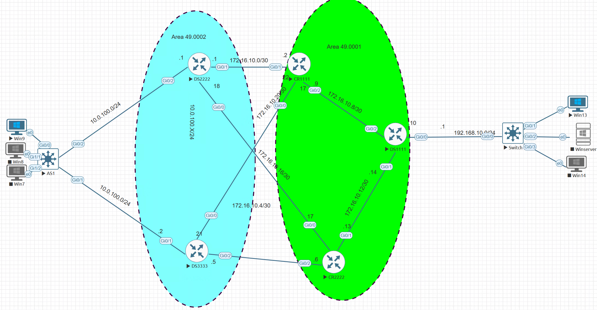

# MyDisLab

## Built With

- Five Cisco vIOS routers
- Two Cisco 93000 switches 
- EVE-NG
- Wireshark
- Iperf3
## Live Demo
> ###### [LIVE DEMO LINK](https://172.16.14.2/legacy/Users/KinG/MyDisLab1.unl/topology/)

## Video Demo
> ###### [VIDEO DEMO LINK](https://www.loom.com/share/7c667355a904437b80cff2848cc4d39e)
##### Getting Started
- clone the repository by running\
    `https://github.com/oyelakinG9/myDisLab.git`
- navigate to the folder\
    `cd myDisLab`

## Authors

👤 **Oyelakin Ridwan Adio**
- GitHub: [@oyelakin](https://github.com/oyelakinG9)
- Twitter: [@oyelakin](https://twitter.com/OyelakinG1)
- LinkedIn: [@oyelakin](https://www.linkedin.com/in/oyelakin-ridwan-4b4a02b6/)

## :handshake: Contributing
Contributions, issues, and feature requests are welcome!
## Show your support
Give a :star:️ if you like this project!
## :memo: License
This project is [MIT](./MIT.md) licensed.
